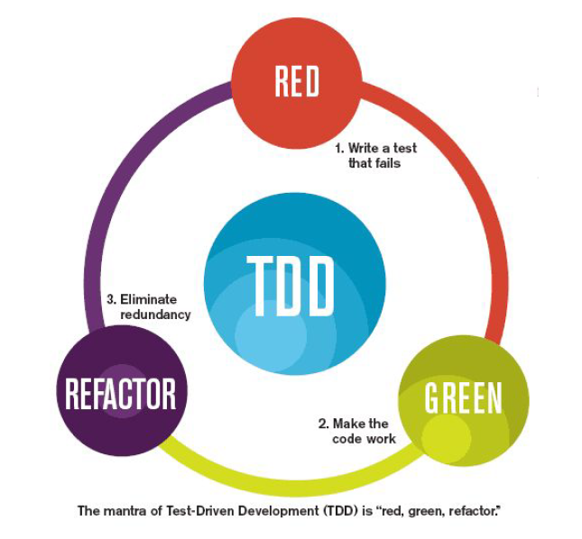

# Test Driven Development

El _Test Driven Development_ (TDD) consiste en desarrollar el mínimo código posible para pasar los tests previamente definidos.

## Montain goat principle

Este principio se explica en el libro _"Principles of Software Engineering Management"_, escrito por ___Tom Gilb___.

> "Take one step at a time up the slippery montainside, and make absolutely sure that each hoof is on solid ground before you take the next step."

Básicamente, lo que quiere decirnos es que antes de continuar con el desarrollo de nuestro código, debemos asegurarnos de que el código que tenemos funciona correctamente. Así, nos aseguramos de que cada nueva funcionalidad que sea añadida funciona correctamente y no rompe nada de lo desarrollado anteriormente.

## Ventajas y desventajas
### Ventajas
- El código producido usando TDD suele ser mucho más limpio y reusable.
- El diseño es mucho más simple.
- En cada iteración (_Scrum_) se obtiene mucho más valor.
- Casi todo nuestro código tendrá un test asociado para ser probado.
- Evita código innecesario.
- Se centra en el código relevante.

### Desventajas
- Requiere más tiempo.
- Requiere disciplina.
- Podemos pasarnos de la raya haciendo tests que tendremos que mantener también a la larga.

## Las tres leyes del TDD
1. _You may not write production code until you have written a failing unit test_.
2. _You may not write more of a unit test than is sufficient to fail, and not compiling is failing._
3. _You may not write more production code than is sufficient to pass the currently failing test._

Estas tres leyes se ven reflejadas en las fases del TDD:

* Escribir un test unitario que falle.
* Hacer el mínimo código posible que haga que el test pase.
* Refactorizar nuestro código.

No debemos tener miedo de refactorizar nuestro código, pues siempre podemos asegurarnos de que los nuevos cambios funcionan volviendo a pasar el test. Algunos buenos consejos para refactorizar son:

* Pasar múltiples condiciones `if` a un bucle `while`.
* Pasar una expresión `if` a una función.
* Implementar el comportamiento donde la información reside.
* Minimizar interacciones entre objetos.

Estas fases deben repetirse paso a paso (como la cabra de montaña) hasta que no tengamos más requisitos que implementar. En cada iteración (_Scrum_) tendremos código 100% testeado, limpio y bonito.

## Además de TDD...
Ahora bien, además de test unitarios, debemos usar otros tipos de test automáticos:

* Tests de integración.
* Tests conceptuales.
* Tests funcionales.
* Tests de rendimiento.
